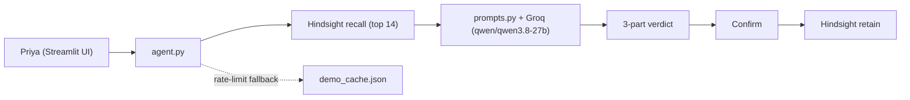

# Shyft Swap Mediator

An AI agent that helps a café shift manager (**Priya Nair** at Brewline Café) settle shift-swap disputes ("you owe me a Saturday", "we agreed verbally") using **Hindsight Cloud** as long-term memory. It remembers every swap agreement, past dispute, Priya's rulings, and standing policy exceptions, and adjudicates new disputes consistently from that record.

**Compare mode** answers each dispute side by side: **Without memory** (vanilla LLM) vs. **With Hindsight memory**.

---

## Architecture



---

## Quickstart

```bash
pip install -r requirements.txt
cp .env.example .env          # fill in your Hindsight and Groq keys
streamlit run app.py          # click "Load Brewline history into Hindsight" once
```

- **Mock mode (no keys needed):** Set `DEMO_MOCK=1 streamlit run app.py` to test the UI offline.
- **Terminal test:** `python agent.py "your dispute text"` runs a quick compare in the console.

---

## Configuration & Environment Variables

| Variable | Default | Purpose |
| :--- | :--- | :--- |
| `HINDSIGHT_BASE_URL` | `https://api.hindsight.vectorize.io` | Hindsight Cloud API endpoint. |
| `HINDSIGHT_API_KEY` | *(placeholder)* | Your Hindsight API key. |
| `HINDSIGHT_BANK_ID` | `brewline-demo-2` | Target memory bank identifier. |
| `GROQ_API_KEY` | *(placeholder)* | Your Groq API key for LLM inference. |
| `FORCE_MODEL` | `qwen/qwen3.8-27b` | Pinned Groq model used for both compare columns (no cascading). |
| `DEMO_TODAY` | `2026-09-28` | Anchors the "today" date for return windows, ruling timestamps, and grader checks. |
| `RECALL_CAP` | `14` | Caps recalled memories to the top 14 deduplicated records for token efficiency and high signal. |
| `DEMO_CACHE_ONLY` | `0` | Set to `1` to serve all 3 demo beats exclusively from `demo_cache.json` for a 100% offline demo. |

---

## Utility Scripts

- **`scripts/build_demo_cache.py`**: Executes the 3 demo beats with memory ON and OFF using the pinned model and populates `demo_cache.json`. This serves as an automated fallback if Groq hits daily token limits during a live presentation.
- **`scripts/reset_demo.py`**: Creates a fresh timestamped demo bank (`brewline-demo-<timestamp>`), writes `.bank_id`, and seeds all 18 historical records. Use this to reset the demo environment cleanly.
- **`scripts/check_beats.py`**: Pure retrieval-only test (zero LLM calls) verifying that all required precedents and overdue records appear in the top-14 recalled memory list for all three beats.
- **`scripts/eval_last_fix.py`**: Comprehensive automated grader evaluating word limits (&le; 170 words), attribution accuracy, window status, and pattern detection across all beats.

---

## Demo Script (Beat 1 &rarr; Beat 2 &rarr; Beat 3)

### Beat 1: Festival Shift Math
- **Click Button or Enter Query**:
  ```text
  Kavya covered Rohan's festival-day Sunday shift last month. She says he owes her two shifts back, Rohan says one. Who's right?
  ```
- **Expected Outcome**:
  - **Without Memory**: Declines to decide, stating no records exist, and asks for written agreement terms.
  - **With Hindsight Memory**: Cites Priya's 2026-07-20 standing policy that festival-day coverage counts as **two shifts**. Accurately notes that the 30-day window (2026-08-30 to 2026-09-29) is **still open** and closes tomorrow relative to `DEMO_TODAY=2026-09-28`.

### Beat 2: Expired Swap Window
- **Click Button or Enter Query**:
  ```text
  Meera says Arjun owes her Saturdays for the two she covered in August. Arjun says the 30 days are up so he owes nothing. What's the ruling?
  ```
- **Expected Outcome**:
  - **With Hindsight Memory**: Recalls both August covers (Aug 8 and Aug 22) and Priya's 2026-07-26 ruling establishing that **expired windows do not cancel debt**. Recommends that Arjun must work two Saturday shifts for Meera within 7 days.
  - **Interactive Action**: Priya clicks **Confirm and save ruling to memory** at the bottom of the page, retaining the ruling with today's date into Hindsight.

### Beat 3: Spot the Pattern
- **Click Button or Enter Query**:
  ```text
  Arjun's back again. He says Sana promised to take his Friday close next week, but Sana says she never agreed. There's nothing in the app.
  ```
- **Expected Outcome**:
  - **With Hindsight Memory**:
    1. Rules the verbal claim non-binding per Priya's 2026-06-14 precedent.
    2. Synthesizes Arjun's dispute history into a **Pattern line** citing his June 14 verbal claim, July 26 expired window debt, and overdue August covers.
    3. Recommends requiring written confirmation in the Shyft app for any future swaps involving Arjun.
