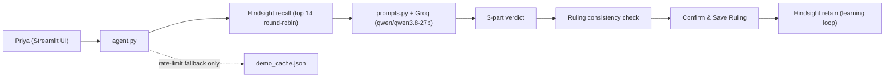

# Shyft Swap Mediator

An AI agent that helps a café shift manager (**Priya Nair** at Brewline Café) settle shift-swap disputes ("you owe me a Saturday", "we agreed verbally") using **Hindsight Cloud** as long-term institutional memory. It remembers every swap agreement, past dispute, Priya's rulings, and standing policy exceptions, and adjudicates new disputes consistently from that record.

**Compare mode** answers each dispute side by side: **Without memory** (vanilla LLM) vs. **With Hindsight memory**.

---

## Architecture



---

## Quickstart

```bash
pip install -r requirements.txt
cp .env.example .env          # fill in your Hindsight and Groq keys
streamlit run app.py          # click "Load Brewline history into Hindsight" once
```

- **Mock mode (no keys needed):** Set `DEMO_MOCK=1 streamlit run app.py` to test the UI offline.
- **Cache disabled (live API calls):** Set `DISABLE_CACHE=1` in `.env` to ensure zero cached fallbacks are used.
- **Terminal test:** `python agent.py "your dispute text"` runs a quick compare in the console.

---

## How Hindsight Memory is Used

### 1. What Gets Retained
- **Bank with a Mission (`memory.ensure_bank()` in `memory.py`)**:
  Hindsight creates and configures a bank with an explicit mission:
  > *"I am the memory of Priya Nair, shift manager at Brewline Cafe. I keep track of shift-swap agreements, who covered whose shift, disputes between employees, Priya's rulings, and standing policy exceptions, so future disputes can be settled from the written record and consistently."*
- **Thread-Safe Client Lifecycle**:
  API client instances are managed in thread-local storage (`memory._local.client`) via `memory._get_client()` to prevent socket or event-loop contention across concurrent Streamlit worker threads.
- **18 Seeded Historical Records (`seed_data.py`)**:
  Pre-loaded into the bank with realistic timestamps (`context="seed"`, `when="YYYY-MM-DD"`). Covers café policies (30-day return window, emergency exceptions, standing app-logging mandate), past disputes, Priya's prior rulings (verbal swap non-binding, festival-day shift = 2 shifts, expired windows do not cancel debt), and approved covers (Meera covering Arjun in August).
- **Interactive Rulings & The Learning Loop (`agent.record_ruling()` in `agent.py`)**:
  When Priya confirms or edits a verdict in the Streamlit UI, the ruling is retained back to Hindsight with the current demo date (`DEMO_TODAY`):
  ```python
  memory.retain(
      f"Dispute on {today:%Y-%m-%d}: {message} Priya's ruling: {ruling}",
      context="dispute ruling",
      when=today,
      bank_id=bank_id,
  )
  ```
  This closes the learning loop: any new ruling immediately becomes part of institutional memory for all subsequent dispute resolutions.

### 2. What Gets Recalled
- **Multi-Query Routing (`agent._recall_queries()` in `agent.py`)**:
  Rather than issuing a single naive query, `agent.gather_memories()` dispatches targeted semantic queries for each dispute:
  1. The dispute text itself (`message[:500]`)
  2. Standing policy: `"Brewline shift swap policy and standing exceptions"`
  3. For every employee named in the dispute (`Arjun`, `Meera`, `Rohan`, `Kavya`, `Sana`):
     - `"past disputes, swaps and Priya's rulings involving {name}"`
     - `"unreturned or overdue swaps owed by {name}"`
- **Round-Robin Merge & Strict Cap (`RECALL_CAP=14`)**:
  Result lists from all targeted queries are round-robin interleaved and deduplicated, capped strictly at the top **14** memories (`RECALL_CAP`). This eliminates prompt bloat, conserves daily token quotas, and guarantees balanced recall across policy, participant history, and specific dispute facts.

### 3. Memory OFF vs. ON (Before & After)

| Dispute Beat | Without Memory (Vanilla LLM) | With Hindsight Memory |
| :--- | :--- | :--- |
| **Beat 1: Festival Shift Math**<br>*(Kavya vs. Rohan)* | **Declines to decide**: States no records exist to determine who is right, refuses to award 1 or 2 shifts, and asks the manager to obtain written agreement terms. | **Applies 2-for-1 precedent**: Recalls Priya's 2026-07-20 standing policy that festival-day coverage counts as **two shifts**. Accurately notes that the 30-day window ending on 2026-09-29 is **still open** and closes tomorrow relative to `DEMO_TODAY=2026-09-28`. |
| **Beat 2: Expired Swap Window**<br>*(Meera vs. Arjun)* | **No historical context**: Has no record of the August covers or policy; cannot judge whether a 30-day expiration erases debt. | **Enforces debt precedent**: Recalls both August covers (Aug 8 and Aug 22 approved in the Shyft app) and Priya's 2026-07-26 ruling establishing that **expired windows do not cancel debt**; orders Arjun to return shifts within 7 days. |
| **Beat 3: Spot the Pattern**<br>*(Arjun vs. Sana)* | **Isolated dispute**: Treats this as an unverified word-against-word dispute; asks both parties to provide documentation. | **Synthesizes pattern & fixes root cause**: Recalls Priya's 2026-06-14 ruling that unlogged verbal swaps are non-binding. Synthesizes Arjun's 3 prior disputes into a single **Pattern bullet** (June 14 verbal claim, July 26 expired window debt, overdue August covers), and recommends requiring written app confirmation for all future swaps with Arjun. |

---

## Supporting Subsystems

### Policy Index (`policy_engine.py`)
- Labeled in the UI and codebase as **"Policy index derived from seed records"**.
- Contains 5 reference policy entries directly matching the historical records in `seed_data.py`:
  - `POL-001` (App Logging Requirement) &larr; 2026-06-01 policy & 2026-06-14 ruling
  - `POL-002` (Festival-Day Multiplier) &larr; 2026-07-20 ruling
  - `POL-003` (Debt Preservation & Window Expiration) &larr; 2026-07-26 ruling
  - `POL-004` (Default 30-Day Window) &larr; 2026-06-01 policy
  - `POL-005` (Emergency Exemption) &larr; 2026-06-01 policy
- **Important**: The LLM does **not** query this registry. All dispute adjudication, precedent citations, and facts used by the LLM come 100% from Hindsight Cloud memory recall.

### Ruling Consistency Check (`guardrails.py`)
- Automated check applied to Priya's draft ruling before saving.
- Displays a clear tick list of 3 practical criteria:
  1. **Deadline stated**: Verifies a specific time frame or date is provided.
  2. **Swap logged in app**: Confirms adherence to the app-logging mandate.
  3. **Neutral tone**: Validates constructive and objective wording without hostility.
- Contains zero legal claims or labor law compliance claims.

### Simulated Roster Payload (`roster_sync.py`)
- Displays a **"Simulated roster payload (no external system contacted)"** badge in the UI with a "SIMULATED" status.
- Provides a clean JSON inspector preview of the structured payload that would be sent to scheduling targets (labeled as example targets). No live external scheduling services are contacted.

### Demo Fallback Cache (`demo_cache.json`)
- Used **strictly as a secondary fallback** when the live Groq API encounters rate limits or connection failures.
- It is **never** checked or served first; live model inference is always attempted.
- Every entry in `demo_cache.json` is generated from a real pipeline run, storing `bank_id`, `model`, and `timestamp`.
- Set `DISABLE_CACHE=1` in `.env` to disable the fallback cache completely, guaranteeing 100% live API execution.

---

## Configuration & Environment Variables

| Variable | Default | Purpose |
| :--- | :--- | :--- |
| `HINDSIGHT_BASE_URL` | `https://api.hindsight.vectorize.io` | Hindsight Cloud API endpoint. |
| `HINDSIGHT_API_KEY` | *(placeholder)* | Your Hindsight API key. |
| `HINDSIGHT_BANK_ID` | `brewline-demo-2` | Target memory bank identifier for Beats 1–3. |
| `GROQ_API_KEY` | *(placeholder)* | Your Groq API key for LLM inference. |
| `FORCE_MODEL` | `qwen/qwen3.8-27b` | Pinned Groq model used for both compare columns. |
| `DEMO_TODAY` | `2026-09-28` | Anchors the "today" date for return windows, ruling timestamps, and grader checks. |
| `RECALL_CAP` | `14` | Caps recalled memories to top 14 deduplicated records for token efficiency and high signal. |
| `DISABLE_CACHE` | `0` | Set to `1` to disable demo cache fallback completely (guarantees live API execution). |
| `DEMO_CACHE_ONLY` | `0` | Set to `1` to serve demo beats exclusively from `demo_cache.json` (offline presentation mode). |

---

## Demo Script (Beat 1 &rarr; Beat 2 &rarr; Beat 3 &rarr; Beat 4)

### Beat 1: Festival Shift Math
- **Click Button or Enter Query**:
  ```text
  Kavya covered Rohan's festival-day Sunday shift last month. She says he owes her two shifts back, Rohan says one. Who's right?
  ```
- **Expected Outcome**:
  - **Without Memory**: Declines to decide, stating no records exist, and asks for written agreement terms.
  - **With Hindsight Memory**: Cites Priya's 2026-07-20 standing policy that festival-day coverage counts as **two shifts**. Accurately notes that the 30-day window (2026-08-30 to 2026-09-29) is **still open** and closes tomorrow relative to `DEMO_TODAY=2026-09-28`.

### Beat 2: Expired Swap Window
- **Click Button or Enter Query**:
  ```text
  Meera says Arjun owes her Saturdays for the two she covered in August. Arjun says the 30 days are up so he owes nothing. What's the ruling?
  ```
- **Expected Outcome**:
  - **With Hindsight Memory**: Recalls both August covers (Aug 8 and Aug 22) and Priya's 2026-07-26 ruling establishing that **expired windows do not cancel debt**. Recommends that Arjun must work two Saturday shifts for Meera within 7 days.
  - **Interactive Action**: Priya clicks **Save ruling to memory** at the bottom of the page, retaining the ruling with today's date into Hindsight.

### Beat 3: Spot the Pattern
- **Click Button or Enter Query**:
  ```text
  Arjun's back again. He says Sana promised to take his Friday close next week, but Sana says she never agreed. There's nothing in the app.
  ```
- **Expected Outcome**:
  - **With Hindsight Memory**:
    1. Rules the verbal claim non-binding per Priya's 2026-06-14 precedent.
    2. Synthesizes Arjun's dispute history into a **Pattern line** citing his June 14 verbal claim, July 26 expired window debt, and overdue August covers.
    3. Recommends requiring written confirmation in the Shyft app for any future swaps involving Arjun.

### Beat 4: Learning Live (Live Policy Adaptation)

Demonstrates how Hindsight memory learns and adapts in real time to new dispute types not covered by the original 18 seeded records.

> [!NOTE]
> **Bank Isolation**: The Beat 4 "Live Learning" tab in the UI automatically writes and reads from an isolated bank: `brewline-live-demo`. This guarantees that Beats 1–3 on `brewline-demo-2` remain completely unaffected and reproducible.

#### Step 1: Dispute A (Novel Case — No Prior Precedent)
- **Enter Query**:
  ```text
  Sana covered 4 hours of Rohan's 8-hour shift yesterday. Sana says Rohan owes her a full shift back because she gave up her evening; Rohan says he only owes 4 hours or half a shift. What's the policy?
  ```
- **Expected Outcome**:
  - **With Hindsight Memory**: Honestly reports that no policy or precedent exists for half-shift covers in Brewline Café's records. Advises manager Priya to set a clear precedent on whether partial-shift covers require full or pro-rated repayment.

#### Step 2: Confirm Manager Ruling
- In the Streamlit UI, confirm or enter Priya's ruling in the **Save ruling to memory** box:
  ```text
  Priya ruled that half-shift covers count as half a shift (pro-rated repayment of 4 hours), establishing this as a standing policy for all staff.
  ```
- Click **Save ruling to memory**. Hindsight retains this new rule with today's date (`2026-09-28`) into `brewline-live-demo`.

#### Step 3: Dispute B (New Dispute, Different Employees — Precedent Applied)
- **Enter Query**:
  ```text
  Aisha covered 4 hours of Tariq's shift on Thursday. Aisha says Tariq owes her a full shift back, but Tariq says he only owes half a shift. What's the ruling?
  ```
- **Expected Outcome**:
  - **Without Memory**: Declines to decide or asks for written agreements; has no awareness of half-shift rules.
  - **With Hindsight Memory**: Recalls Priya's newly confirmed ruling from Step 2. Decides that Tariq owes Aisha half a shift (4 hours pro-rated repayment), proving that Hindsight has learned the new policy live without code changes or fine-tuning.
